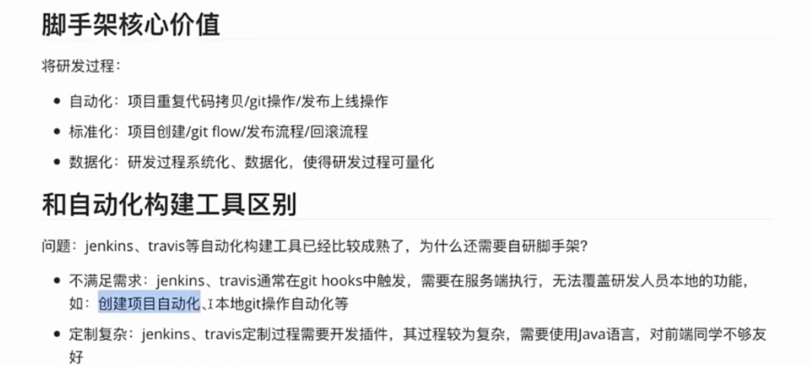
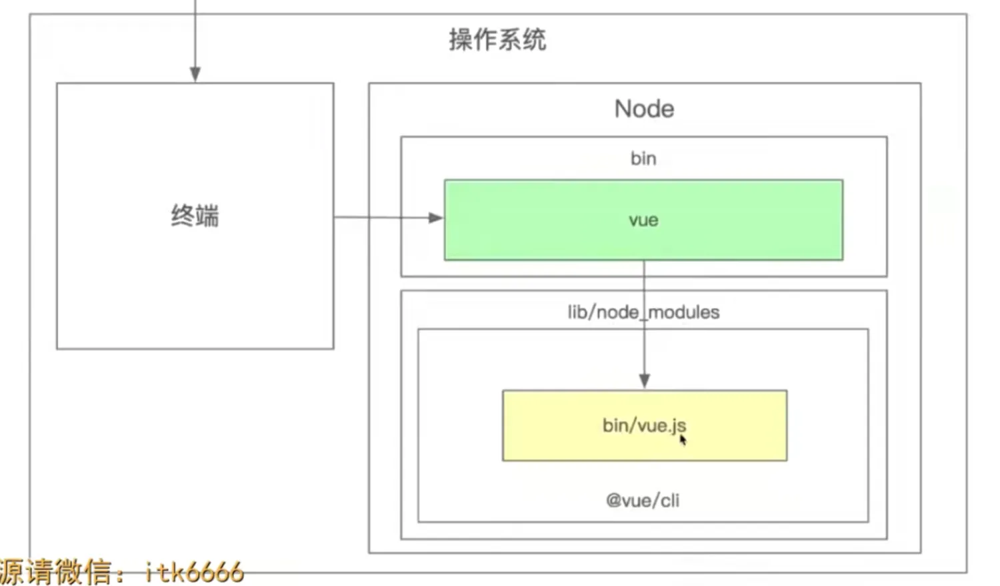
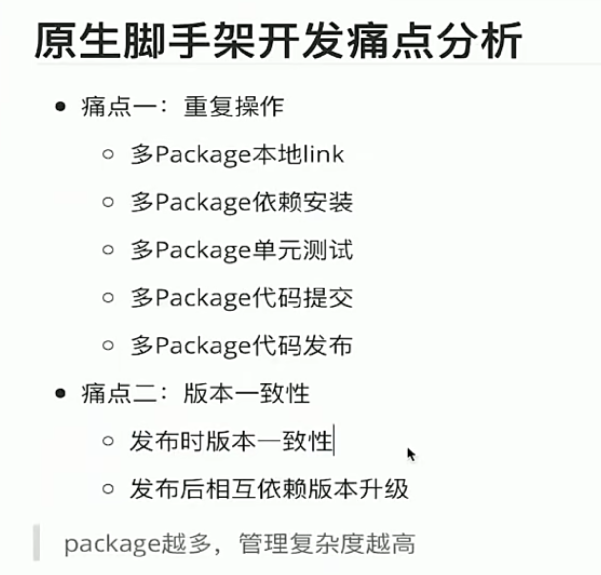

# 慕课乐高项目为什么需要脚手架
1. 慕课乐高涉及的项目比较多，通过脚手架实现项目快速创建可以提高效率，也是架构师该做的事
2. 多个项目的发布上线其实是同一个流程，这个重复流程也可以通过脚手架进行处理

# 开发脚手架的核心目的
站在前端研发的视角，开发脚手架的目的就是提高研发效能

# 脚手架开发入门
## 脚手架实现原理
为什么说脚手架本质是一个操作系统的客户端，因为脚手架执行命令本质就是去执行node，而node本质上是一个可执行文件，也就是说node是个客户端，
node执行的文件vue.js只是传递给node的参数,所以脚手架的本质就是一个操作系统的客户端

2. 如何给脚手架命令添加别名？
ln -s ./imooc imooc2 (通过ln -s 添加白链接)

## 脚手架开发流程
### 脚手架开发难点：
1. 分包：将复杂的系统拆分成多个模块
2. 命令注册
vue create
vue add
vue invoke
3. 参数解析
4. 帮助文档
5. 命令行交互
6. 日志打印
7. 命令行文字变色
8. 网络通信（HTTP/WebSocket)
9. 文件处理
vue command [options]<params>

### 脚手架开发流程
1. 新建npm项目
2. 项目初始化，配置bin命令
3. 书写node参数文件
4. 发布npm包
5. 安装下载npm包 - 命令执行

### 脚手架本地调试方法
1. 只有一个包的情况下，在你的脚手架目录里面通过npm link 添加软连接，然后在本地直接使用脚手架命令就可以对应打印出本地脚手架的内容

#### 前置知识点
npm link 是一个非常有用的 npm 命令，它允许你在本地开发和测试 npm 包，而无需每次修改后都发布到 npm 仓库

2. 如果有多个包相互依赖呢，怎么做本地调试
采用npm link

### 脚手架命令注册和参数解析

## 什么是脚手架

# 脚手架框架搭建

## lerna搭建脚手架框架
1. 创建包文件夹（monorepo）
2. 进入刚创建的包文件夹
3. 安装和初始化lerna (lerna init)
4. 通过lerna create 创建子包目录（core，utils等）

在每个包下面去执行lerna命令
lerna exec -- rm -rf node_modules

# 脚手架架构设计。